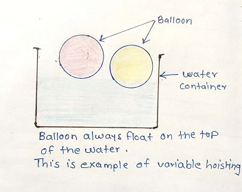
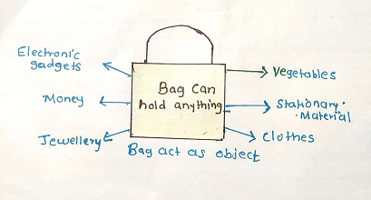

# Javascript


* JavaScript is used for both client side as well as server side
* In JavaScript, everything is an object.
* It is dynamic type language means type of variable get evaluated at runtime
* It is most popular language in the world.

------

## History of JavaScript

* In 1995 couple of guys started company called netscape navigator which was first browser in the market at that time there was 2 main player in market Microsoft and Apple
* It was paid software by using that software people can view the website after that lots of companies started buying this browser and started their own websites
* Around 1996 Microsoft offered internet explorer free so that netscape was not able to make money after that netscape decided to make it’s browser free and open source
* At that time java was market leader it was very popular language which were used for backend and was missing front end part 
* So Netscape Navigator and Sun Microsystem came together and Brendan Eich  created language within 3 week which was originally named Mocha ,later renamed to LiveScript and then JavaScript and denoted it to ECMA to create a standard implementation
* But java is own by sun microsystem so ECMA couldn’t use the name JavaScript so they adopted a name called ECMA Script. 
* That’s why we called it as ES so we can say javascript is nickname and official name is ECMA script

------


## Control Structure

*  **if-else** -It is heavily used 
*  **for** - Abstraction
*  **switch case** -better way available in JS
*  **while** -Rarely used
*  **do while** -Rarely used

------

## Operators

* **Arithmatic** &nbsp; +, -, *, /, ++, --, +=, -=, *=, /=, ==,===
* **Logical** &nbsp;  && , || , !
* **Bitwise** &nbsp;  | , &, ^ 
* **Ternary** &nbsp;  ?:

------

## JavaScript Tech debt
* '+' is used for both conacatination as well as addition. It always do concat when one of variable is string type. Eg “Javascript”+125 =>Javascript125,&nbsp;&nbsp;  [12,15,16]+"hello" =>12,15,16hello
*  ===  identify/type check. It first check datatype and then value eg: "25"===25 =>false, 0==="false" =>false
* Type of null  return Object
    * because when the language was developed there was check whether it is premitive or non-primitive and thre was 1 switch case was missing which was checking null part thats why it call to non-premitive i.e object

------
## JavaScript Variables

* Javascript variable is container which hold some kind of data
* Data could be a primitive or non-premitive.
* Javascript variable define using var keyword.
* Javascript is dynamic type variable means you don't have to compile it you just need to declare and it will run

There are 3 way to create javascript variables
1) Using Var (ES5)
2) Using Let (ES6)
3) Using Const (ES6)

### Difference between Var, Let, Const
|var  |Let|Constant  |
|------|------|------|
|Can be Redeclared|As per ES6 std. it cannot be Redeclared|As per ES6 std. it cannot be Redeclared   |
| Can be reinitialized  |Can be re-initialized | Can’t be re-initialized but non-premitive value can be updated|
|It has functional scope|It has lexical scope|It has lexical scope|
|ES5|ES6|ES6|
|Hoisted|It can’t be hoisted|It can’t be hoisted|


- var

    - Whenever we declare variable using var keyord it always  get hoisted at the top of the functional scope.

  


    - Variable declaration get hoisted, assignment doesn't get hoisted

````
var  store=50;     
var store="pranesh"; //can be re-declared
console.log(store)   //pranesh
console.log(counter); // undefined
var counter; //get hoisted
counter = 1

Output: 
Pranesh
Undefined
````

- let
``````
let store = "hello"; 
  let  store = "world"; //can not be redeclared
  console.log(store)  // 'Error :store' has already been declared
``````

``````
console.log(store) //can not access before initialization
let store="hello"; //can't be hoisted
``````
``````
let store = "hello";
  store = "world"; // Can be re-initialized
console.log(store) ; //It prints world
``````


- const
``````
    const a=
    {
       id:1,
       name:'pranesh',
    } 
console.log(a) // It gives { id: 1, name: 'pranesh' }
a.address='virar'; // can be updated
console.log(a)  //  { id: 1, name: 'pranesh', address: 'virar' }

``````

``````
const store="Pranesh"
store="aakash" //can not be re-initialize and gives error
console.log(store) 

``````

``````
const store="Pranesh"
const store="aakash" //can not be re-declared and gives error
console.log(store) 

``````

----

## JavaScript Datatypes 
#### 1. Primitive datatype :
* Primitive are basically call by value or pass by value
* Once define can not be changed
* It can hold only one type of data
* Types of primitive data type
    * String
    * Number
    * Boolean
    * Undefined
    * Null
    * Symbol(ES6)

1. **String** - 
- Anything which is written inside " " is string
````
var a="undefine"
typeof a
undefined

var a="true"
typeof a
true

var a="null"
typeof a
null

var a="[]"
typeof a
[]

var a="{}"
typeof a
{}
````
2. **Number**
- It accept only number value

````
var a=50
typeof a 
number
````
3. **Boolean**
It accept only boolean value either true or false

````
var a=true
typeof a
true
````
4. **Undefine**
- It is value also and type also.
- Undefine normally used by javascript engine as a developer we should not use this at all
- when we don't assign any value to variable , javacript  assign undefine to it internally
````
var a=15
typeof a
true
````
5. **Null**
- It represent empty or null value
````
var a=null;
typeof a
Object
````


#### 2. Non-Primitive datatype :

- Non-Primitive are basically call by reference or pass by reference
- Once define can be changed
- It can hold Primitive as well as non primitive data

1. **Object**
- It can hold anything.
- In javascript everything is object
- It is declared using { }
- It has key value pair.

 

````
const store={
    id:1,
    name:'pranesh',
    address:'virar',
    status:true,
}
console.log(store) // { id: 1, name: 'pranesh', address: 'virar', status: true }
````

2. **Array**
- In javascript there is no such a thing as array.
- Array is nothing but kind of specialized object.
- It is declared using [ ]
- Length of array is always last index + 1

````
const arr=[12,14,'Pranesh',true,[10,12]]
console.log("Length",arr.length)
console.log(arr)

Output :
Length 5
[ 12, 14, 'Pranesh', true, [ 10, 12 ] ]
````
------

## Conditional Evaluation
 
- **Falsy value**
    - null
    - undefined
    - NAN
    - " "
    - 0
    - false

``````
Boolean(null)       //false
Boolean(undefined)  //false
Boolean(NAN)        //false
Boolean("")         //false
Boolean(0)          //false
Boolean(false)      //false
``````
- **Truthy Value** - All the value other than falsy value are truthy values
    - Empty array [ ]
    - Empty object { }

``````
Boolean([])        //true
Boolean({})        //true
Boolean('null')    //true 
Boolean('hello')   //true
Boolean('1')       //true

``````
-  **Logical AND Table**


|Operands|Result|
|--------|-------|
|true && false|false|
|false && false| false|
|false && true| false|
|true && true |true  |

-  **Logical OR Table**

|Operands|Result|
|--------|-------|
|false && true|true|
|true && false| true|
|true && true| true|
|false && false |false |

- **Negation**
    - ! 0 = 1
    - ! 1 =0

------

 ## Arithmatic operation of premitive and non-premitive types
- When we use  + in between any variable ,javascript interpreter first check any of the variable value is string or not if it is string it will typecast value into string
``````
var num1=10;
var num2='12'
num1 * num2   // "1012"

var num1='10';
var num2=undefined
num1 * num2  // "10undefined"

var num1=10;
var num2=12
num1 * num2   // 120
``````
- when we do multiplication substraction,division and modulus, javascript interpreter first check any value of the variable is number 
- If it is number it will convert all variable back to the number and then do operations
- But only in case of addition it works reverese means + act as concatination(Tech debt) 

`````` 
var cost='100';
var tax=0.18
var value=cost * tax;
typeof(value)   //Number
console.log(value);   // 18
``````
- When we use + in front of any value it will cast it into number

``````
var cost='100';
var tax= 0.18
var value=cost + tax;   //concatinate(Tech Debt)
console.log(typeof(value))  //String
console.log(value);   // 1000.18

var cost=(+'100')  //typecast into number
var tax= 0.18
var value=cost + tax;
console.log(typeof(value)) //Number
console.log(value);   // 100.18

var cost="100"; 
var tax= "0.18";
var value=cost + tax;
console.log(typeof(value))   //String
console.log(value);   // 1000.18

var cost=(+"100"); 
var tax= (+"0.18");
var value=cost + tax;
console.log(typeof(value))  //Number
console.log(value);   // 100.18
``````
- Javascript says, you should not use undefied variable directly
- It is only part of Javascript
- whenever you perform arithmatic operation with undefined it always gives NAN except one of the condition of tech debt(+ act as concatination)

``````
undefined + 12;  //NAN
undefined + undefined;  //NAN
undefined + null;   //NAN
undefined * null;   //NAN
undefined + "20";   //undefined20
undefined / null;   //NAN
undefined - null;   //NAN
undefined - "A";    //NAN
``````
- As we know null, undefined, NAN, " ", 0, false are falsy value and other than these, all are truthy values 

``````
var book=true;
var cost=100;
console.log(book + cost)  //101

var book=true;
var cost=false;
console.log(book + cost)  //1
console.log(book * cost)  //0

var name=null;
var exp=12;
console.log(name * exp)  // 0
``````
``````
if([] && "")  
{
    console.log("Pranesh");
}
else 
{
    console.log("Nano");
}
``````
- when we try to add non-primitive data, javascript engine first  convert it into string type and then is to be added

``````
[] + []  // ''

[1] + [2,3,5,7]  // "12,3,5,7"
``````
------

## Functional Scope
- Function scope always start with function.
- Each program or application has it's own global functional scope
- And each function within program has it's own  local functional scope which exist until the function exists
- Whenever we declare variable inside function , it always get hoisted at top of the functional scope

``````
var a;
var b="ok";
console.log(1,a+b);
a=20;
function hello()
{
    var a=3;
    console.log(2,a);
}
hello();
console.log(3,a);
a=10;
console.log(4,a);


Output:
1  undefineok
2  3
3  20
4  10
``````
------

## Lexical Scope
- Lexical scope always start with curly braces.
- The lexical scope has both local and global scope.
- let and const has lexical scope
- It is also called block scope
-  variable is ES6 will check  lexical scope first, then parent lexical scope and then functional scope.

``````
let a=4;
if (a)
{    //block or lexical scope
let b=9;
let a=9;
console.log(a+b);
b=a+b;
}
function hello() //functional scope
    {
if (a)
{    //block or lexical scope

    console.log(a+b);
}
else
{
    //lexical scope
}
    }
    hello();

o/p
18
b variable is not defined
``````
------

## Call by Value and Call by Reference 

1. **Call by Value**
- Primitive are basically pass by or copy by value
- eg : when we share photocopy of assignment to friend and he makes several changes in his own copy it means he basically update his own copy not original one


``````
var language="javascript";
var language2=language;
language="java";

console.log(language);  //java
console.log(language2); //javascript
``````


2. **Call by Reference**
- Non-primitive are basically are call by or pass by reference
- eg: Google doc or sheet . we basically share link not document so when anyone make changes it will reflected in original one so we are sharing reference to the person

``````
var mart=
{
    item:'grocery',
    checkout:1,
    open:true
}
var mart2=mart;
console.log(mart)
mart2.open=false;
console.log(mart2)
console.log(mart)

Output
{ item: 'grocery', checkout: 1, open: true }
{ item: 'grocery', checkout: 1, open: false }
{ item: 'grocery', checkout: 1, open: false }
``````
------

## Function
- Javascript has given lot of privileges to function
- It is always referred as first class citizen.
- It can be hoisted
- It has local and global scope
- It can be overidden
- It act as container
- It is object
- In ES5 function behave exactly like variable behaviour

``````
function fn_name()
{
    console.log("print fn1")
}
function fn_name()
{
    console.log("print fn2")
}
fn_name(); //second function override first function

Output
print fn2
``````
- In below code function first get hoisted at the top of local functional scope and it's scope remain inside that function only

``````

function fn_name()
{
    console.log("10")
}
function outside()
{
    console.log("from outside")
    fn_name(); //get hoisted
function fn_name()
{
    console.log("from inside")
}
}
outside()
fn_name();

output
from outside
from inside
10
``````
- Whenever we pass parameter to function it create local variable inside that function 
``````
var sport ="chess";
function printsport(sport)
{
    sport="cricket";
    console.log("sport ",sport);

}
printsport();
console.log("outside sport ",sport)

Output
sport  cricket
outside sport  chess
``````

1. **Firt class citizen**
- Function is called first class ctizen
- It means function can do anything in javascript.
- It has all privileges.
- It can act as object.
- It can be assigned to variable.
- Function can pass as parameter to another function
- Function can return from another function
- Function can also be created as conctructor or prototype.

``````
//Function return from another function

function hello(somevalue)
{
    console.log("inner",somevalue);
    function innerHello()
    {
        console.log(somevalue*2)
    }
    return innerHello
}
var val=20;
var result=hello(val)
console.log(result,typeof result)
result();

Output
inner 20
[Function: innerHello] function
40
``````
------

## Funcion declaration and function assignment
1. **Function declaration**
- Function declaration is started with function keyword.
- All the function declaration get hoisted

``````
doTask();
function doTask()    //function get hoisted
{
    console.log("print task");
}

Output:print task
``````
    
2. **Function assignment**
- Whenever you create function assignment, function does not have name it is called anonymous function.
- It does not get hoisted because only variable declaration get hoisted not assignment and we are here assigning function to variable

``````
doTask("hello") 
var doTask=function() 
{
    console.log("print task2")
}
// it throw error  doTask is not a function
``````
- To avoid this we will have to call this method after function defination

``````
var doTask=function()  //this vaiable hold reference to the function
{
    console.log("print task2")
}
doTask("hello") 

Output:
print task2
``````
------
## Higher Order Function
- Any function which take function as argument argument or return funtion from that function is called higher order function.
- It is used to make code more configurable,flexible and robust
- It is heavily used in react

`````
// passing function as parameter to function

const print=function(value)
{
    console.log("printing",value)
}
const completeTask=function(param)
{
    const a=200;
    const c=a*5;
    param(c)
}
completeTask(print);

Output:
printing 1000
``````
------
## Pure Function
- The pure function is function in which when we pass value it will always return same value.
- This function only operate on given parameter 
- we do not modify parameter

``````
function add(a,b)
{
    return a+b;
}
var a=10;
var b=20;
const result=add(a,b);
console.log("resut "+result)

output
30
``````
------
## Immediately Invoked Function Expression (IIFE)
- It is also called self executing function expression.
- This function can call only once.
- function can act like private method
- We use a semicolon before write function to safe gaurd code.

``````
;(function()
{
    console.group("initialization");
})();

Output: initialization
``````
------
## Arrow Function 
- It was introduced in ES6
- Arrow function is always function expression and function assignment 
- It can not be function declaration 
- That means arrow function can not be hoisted

``````
var b=(param)=>
{
console.log("Result ",param)
}
b(10);
b(20);

output
Result 10
Result 20
``````
------
## Built in construtcors

- Array
- Object
- String
- Function
- Number
- Boolean
- Date
- RegEx
------
## Built in methods of Array construtcor
|Methods|Description|
|----------|---------|
|push()|Add the item at the end of the array|
|pop()|Remove the item from the end of the array |
|shift()|Remove the item from the begining of array|
|unshift()|Add the item at the begining of array|
|concat()|To merge two or more arrays and return new array|
|foreach()|To looping the function or iterate over all items of arary|
|map()|To transforming array|
|filter()|To filter out the value eg. to remove empty string from array|
|indexOf()|To find the index of specified element |
|includes()|Exactly do the same as indexOf() but instead of returning index it return true or false|
|join()|To convert one datatype into another|
|slice()|To split the array|

------
## Built in methods of Object construtcor
|Methods|Description|
|----------|---------|
|keys()|To show all the key of given object |
|freeze()|It does not allow to change the value of the object|
|toString()|Convert object into string|

------
## Built in methods of String construtcor
|Methods|Description|
|----------|---------|
|toUpperCase()|converts string into upper case |
|toLowerCase()|converts string into lower case |
|split()|split the string with specified delimeter|
|replace()|replace one string with another string|
|trim()|To remove space from both end of the string|
------
## Built-In Functions
|Methods|Description|
|----------|---------|
 | 	setTimeOut()    | It delay the code execution for specific period of time. It runs only once.   |
| 	setInterval()   | it keeps on runnning. It takes lot of memory.   |
 | 	parseInt()   | It converts any number into an integer value.    |
| 	stringify()   | convert an object into a JSON string.   |
------