# GIT
* Git is like a kind of recording system where we can track everything 
* It is used for collaboration .
* It was created by Linus Torvalds in 2005
* It give us flexibility of managing everything
* It is free, open source distributed version control system 
------
## Version control system Types
### 1. Centralized Version Control System
* Here only one developer can work at a time. Unless he push the code to the server, another developer can’t work on it. Eg SBN
### 2. Distributed Version Control System
* Here multiple developer can work together on the same project and can access or update file at a same time. whatever the changes made by them everything will be tracked
------
## Git commands
|Commands|Description|
|--------|-----------|
|git init|Create new empty repository|
|git status|Show the current status of git tree|
|git  add <file_name>|Add the file to staging area|
|git add . OR git add *|Add all the file to staging area|
|git commit –m <commit_message>|record the file permanently in the version history|
|git log|List out history of commits made in the repository|
|git diff|Show the changes of modified file before commiting|
|git show <commit_id>|Show the metadata and content changes of the specified commit|
|git remote add origin <remote_repo_URL>|Connect your local repository to remote repository|
|git push origin <branch_to_be_push>|Push the local commited changes to remote repository|
|git pull origin <branch_to_be_pull>|Fetch changes from remote repository and merge into local repository. If remote repository one step ahead of local repository then we use this command|
|git clone <remote_repo_URL>|Create local copy of a remote repository|
|git branch <branch_name>|Create new branch|
|git branch <branch_name> -D|Delete a branch|
|git  checkout <file_name>|Restore file to last commit|
|git checkout <branch_name> |Switch from one branch to another|
|git checkout -b<branch_name>|Creates new branch and also switch to it|
|git merge <branch_to_be_merge>|Merge changes from specified branch into current branch|
|git stash|Save unfinished work into stash stack without commit|
|git  stash list|List all stash files|
|git stash pop|Pop the changes from stash stack|

------

## Git commands 

 First we will create folder and add few files in that.

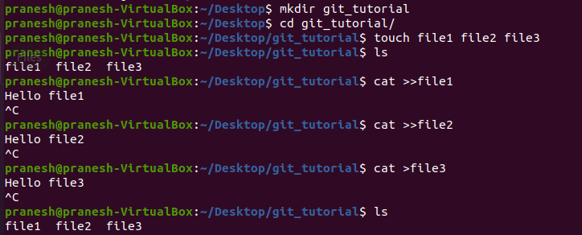

### 1. **git init**- 
* It create new empty repository and .git folder will be created.
* any folder or file which start with dot (.) is called as hidden folder or file

### 2. **git status** -
* It Show the current status of git tree.

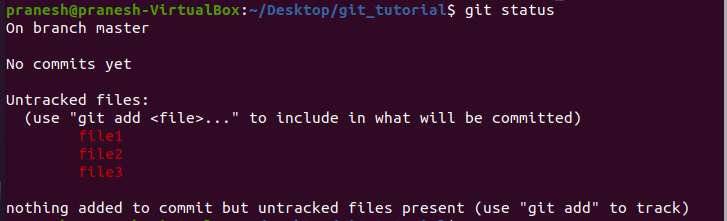

### 3. **git add [file name]** -
* This command add specified file into staging area

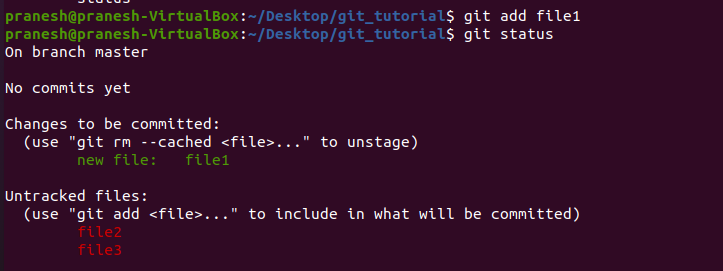 -

 ### 4. **git add * OR git add .** -
* This command add all files into staging area

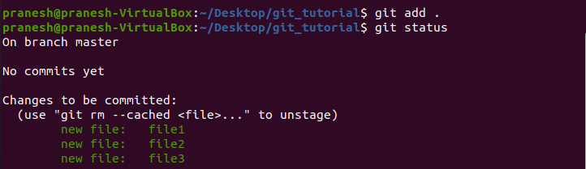

### 5. **git commit -m [message]** -
* It record the file permanently in the version history

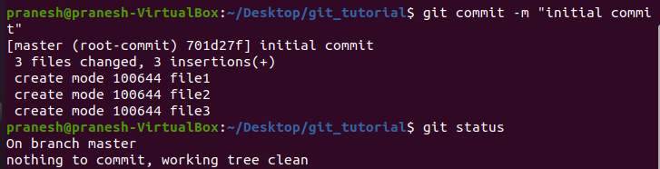

### 6. **git diff** -

* Show the changes of modified file before commiting
* Here we are modifying file1

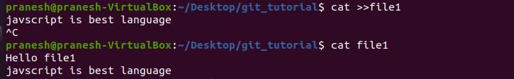

 
 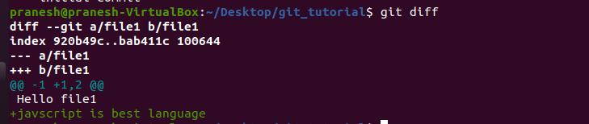 

### 7. **git log** -

 * It list out history of commits made in the repository

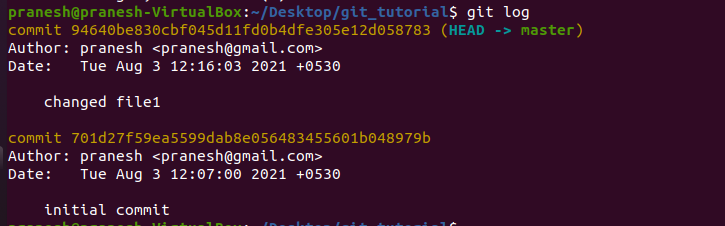

### 8. **git show <commit_id>** 
* It Show the metadata and content changes of the specified commit

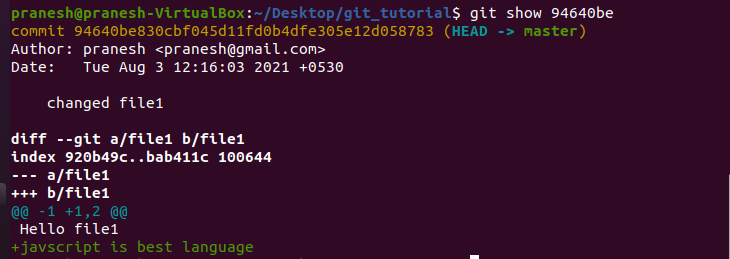

### 9. **git remote add origin <remote_repo_URL>** 
 * Connect your local repository to remote repository

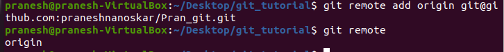

### 10. **git push origin <branch_to_be_push>** 
* Push the local commited changes to remote repository

### 11.**git branch <branch_name>**
* It is used to create new branch

### 12. **git branch**
* It list down the all existing branches 

### 13. **git checkout <file_name>**

- It restore file to the last commited stage

### 14. **git branch <branch_name> -D**

* it delete the specified branch

### 15. **git checkout <branch_name>**
* It is used to switch from one branch to another

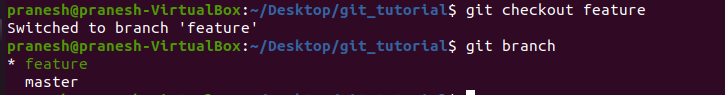

### 16. **git checkout -b<branch_name>**
 * Creates new branch and also switch to it

### 17.**git merge<branch_to_be_merge>**
 * It merge specified branch with current branch

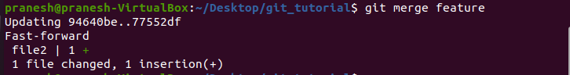

### 18.**git stash**
 * It  Save unfinished work into stash stack without commit

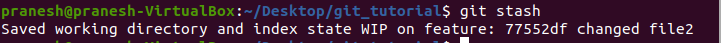

### 19. **git stash list**
* It list all stash files

### 20. **git stash pop**
* It pop the changes from stash stack

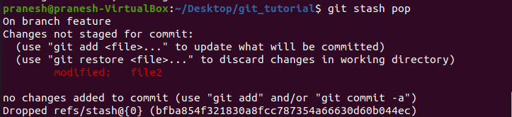

----
