# Linux

## Linux Background
- In the 1970s the Bell lab company created a system named Unix.
- Because of huge licensing fee, some of the researchers from Berkeley and some ex-employees from Bellab created new Unix code base system called BSD ( Berkeley Software Distribution).
- In the 1980s, The Richard Stallman started to develop free, open-source software with few office’s friends
- In 1985 he started his own non-profit organization named free software foundation and started creating his own OS called GNU. It had kernel which was hurd (was not that much good)
- In the 1990s ,The Linus Torvalds created his own kernel and he made it completely free for everyone.
- In 1991, Richard Stallman and Linus Torvalds came together and created GNU/Linux which is absolutely free of cost.
- That’s why Richard Stallman and Linus Torvalds are called the godfathers of free software. 
------
## What is linux
* Linux is kernel not OS. 
* kernel is core of OS which interact with hardware
* It require different s/w to run the linux . 
* Linux itself can’t be operate.
* Linux released under the GNU general public license(GPL) that means anyone can run, study and modify the software
------
## Popular Distribution of Linux
* GNU/Linux (First Distribution)
* Debian
    * Ubuntu
    * Mint
* Reahat
    * Fedora
    * CentOS
------
## Other Distribution
* DOS/Windows
* Unix
* Apple/Unix
* HP/Unix
* FreeBSD
* NetBSD
* OpenBSD
------

## Linux commands

### 1. **Ls**
**a) ls**
- List out all the files and folder within current directory

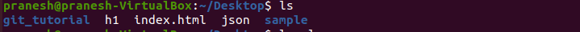

**b) ls -l**
- List out all files and folder in detail format

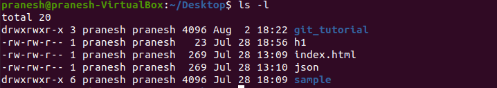

**c) ls -r**
- Display files and folder in reverse format

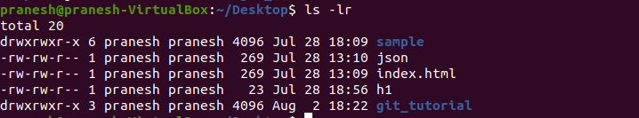

**d) ls -a**
- List all files along with hidden file start with dot

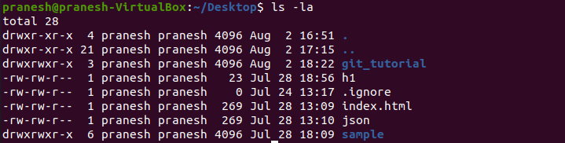

**e) ls -t**
- Display the files in ascending order i.e latest one will be on top and old one will be at the bottom

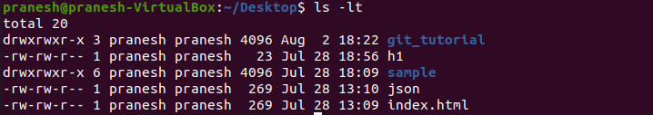

**f) ls -h**
- Human readable format

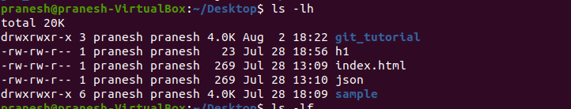

**g) ls -F**
-	Add the ‘/ ’ character at the end of each directory
 
 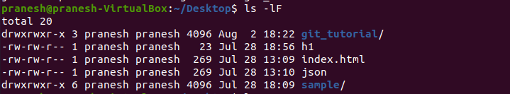

 ### 2. **cd**

**a) cd ~**
- Takes you to the home directory

 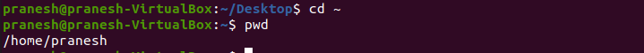

 **b) ~/**
 - First it look for home directory and go to the specified path

 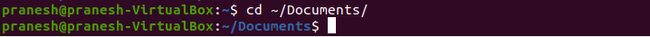

**c) cd ..**
- It goes one directory back and then go to the specified path

 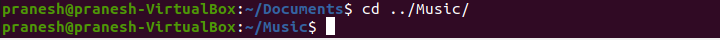

 **d) cd -**
 - To switch between previous directory and current directory and vice-versa

 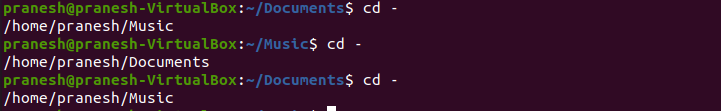

 **e) cd/**
- It goes to root directory

 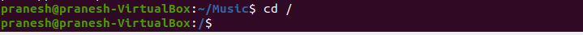

 ### 3. **pwd**
 - Present working directory
 
 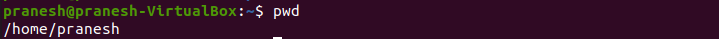

 
 ### 4. **cp**

  **a) cp [file_name] [destination_Path]**
  - Copy the files from one location to another

 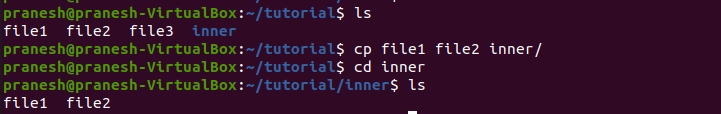

  **b) cp -rf [folder name] [destination_Path]**
- Copy the folder from one location to another

 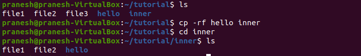

### 5. **mv**
**a) mv  [file_name] [destination path]**
  - Move the file from one location to another

 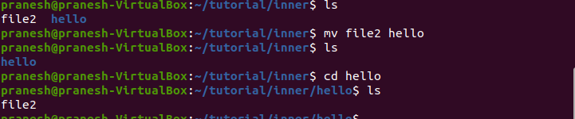

 **b) 	mv [old_file_name] [New_file_Name]**
- It is also used for rename the file

 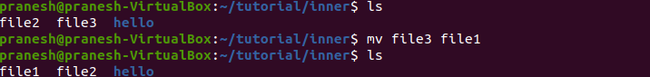

 ### 6. **rm**
 **a) rm –rf [dir_name]**
- It is used to remove directory.

 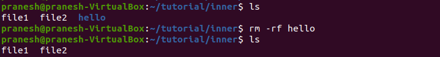

 **b) rm –rf[*]**
 - 	It will delete all the files and folders inside current directory.

 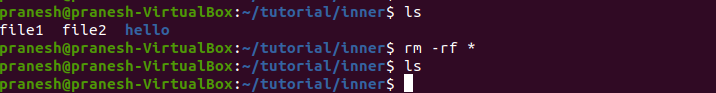

 **c) rm – [*]**
- It remove all files but not directory

 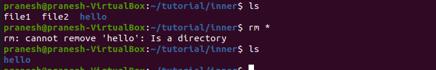

  ### 7. **mkdir**
 **a) mkdir [dir1][dir2][dir3]**
 - To create multiple directory

 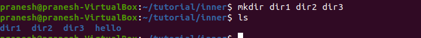

 **b) mkdir [dir1/dir2] -p**
 - To create recursive directory

 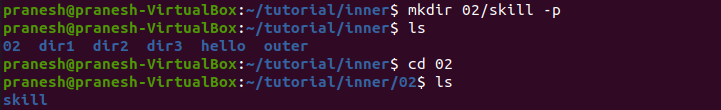

 ### 8. **rmdir**
 - It remove only empty directory

 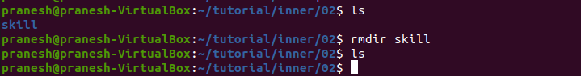

 ### 9. **who**
 - It shows how many users are logged in the system

 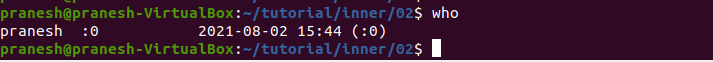

 ### 10. **whoami**
 - Display the current logged in user

 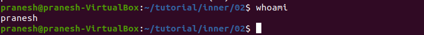

 ### 11. **history**
 - It display all the commands which we have used earlier.
 
  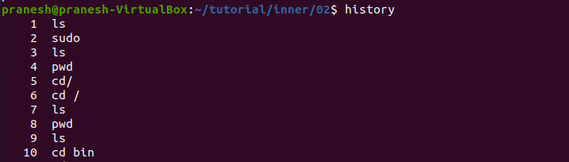

  
 ### 12. **cat**

 **a) cat [file_Nme]**
- To display the content of the file on terminal

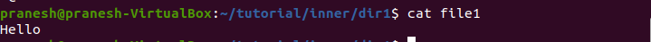

 **b) cat > [first_file]**
 -	overide the content of first file.

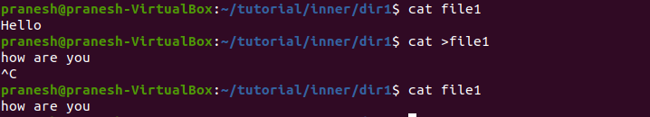

 **c) cat >>[first_file]**
 - Appent to the content of first file

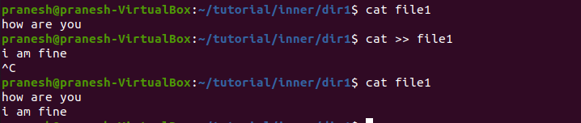

 ### 13. **echo**
 - It is used to print something on terminal

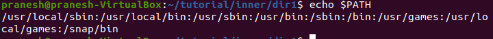
 
  ### 14. **touch**
 - It is used to create new file.

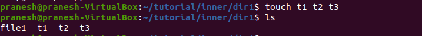

 ### 15. **top**
 - Gives all system level information and current load of system

 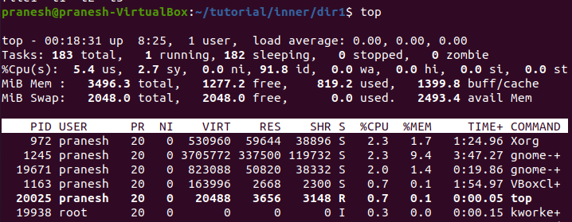

### 16. **ping**
- Used for checking internet connectivity and netwok speed 

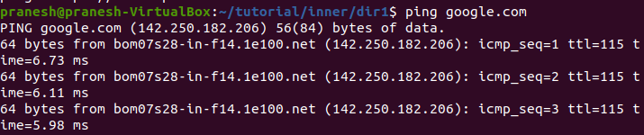

  ### 17. **which**
- It gives a path of specified command or softaware

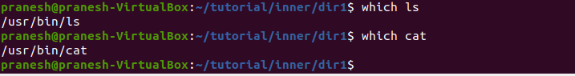

------
## Linux commands
|Commands|Syntax|Descriptions|
|--------|------|------------|
|ls|ls|List out all the files and folder within current directory|
||ls -l|List out  all files and folder in detail format|
||ls -a|List all files along with hidden file start with dot|
||ls -h|Human readable format|
||ls -F|Add the ‘/ ’ character at the end of each directory|
||ls -r|Display files and folder in reverse format|
||ls -t|display the files in ascending order i.e latest one will be on top and old one will be at the bottom|
||ls -R|Recursively print all the directory content|
|cd|cd|Takes you to the home directory|
||cd  ~|Takes you to the home directory|
||cd  ~/[directory]|First it will look for user home folder and move to the specified folder|
||cd ..|Move to a one directory back|
||cd ../../../|Move back to 3 folder|
||cd ../ [path]|Will go one folder back and then goes to specified directory|
||cd -|To switch between previous directory and current directory and vice-versa|
||cd /|Switch to the root directory|
|pwd|pwd|Print working directory. It print the current path of working directory|
|cp|cp [file_name] [destination_Path]|Copy the file from one location to another|
||cp  -rf[folder_name][destination_Path]|Copy the folder from one location to another|
|mv|mv [file_name]  [destination path]|It is used to move the file from one place to another|
||mv [old_file_name]  [New_file_Name]|It is also used for rename the file|
|rm|rm [file_Name]|It remove the file
||rm  *|Will delete all the files but not directory|
||rm –rf [dir_name]|Delete specified directory|
||rm –rf*|It will delete all the files and folders inside current directory.|  
|mkdir|mkdir [Directory_Name]|For creating directory|
||mkdir [dir1][dir2][dir3]|Create multiple directory|
||mkdir [dir1/dir2] -p|To create recursive directory|
|rmdir|rmdir  [Directory_Name]|It will remove only empty directory.|
|who|who|Display the list of users who are currently logged into  system|
|whoami|whoami|Display the current logged in user|
|history|history|List out all the commands which we have used earlier|
|exit|exit|Exit from the current terminal|
|cat|cat  [file_Nme]|Display the content of the specified file on terminal|
||cat > [first_file] |Override  content of first file|
||cat >> [first_file] |Will append to the content of the first file |
|more |more [file_name]|It gives less information|
|less|Less [file_name]|It gives more information|
|echo|echo [parameter]|It is used to print whatever we want on terminal|
|touch|touch [file_name]|It is used to create new file|
||touch [file1] [file2] [file3]|Used to create multiple files at a same time|
|top|top|Gives all system level information and current load of system|
|ps|ps -ef|It list all application running on the system|
|ping|ping [Ip_address]|To check internet connectivity and speed|
|ifconfig|ifconfig|It gives network information and addresses|
|ssh|ssh [ip_address]|It is used to access remote server.|
|wget|wget [URL]|It is command line browser used for downloading files through internet|
|man|man [command]|It gives manual page of given command|
|which |which [command Or software]|It gives a path of specified command or  software|
|head|head -n|Print specified number of line from beginning of file(10 by default)|
|tail|tail  -n|Print specified number of line from end of the file(10 by default)|
||tail -100f|It continue update last 100 lines|
|clear|clear|Clear the screen (shortcut is Ctrl+ L)|
------

## File System of Linux
* In linux everything is file like program, folder, memory are all file. 
* Root file system starts with '/'.
* '/' is root directory of entire file system hierarchy
* Root is denoted by #
* Normal user is denoted by $
* Root user has all permission of system.He can do anything

### Filesystem Hierarchy
|Directory|Description|
|---------|-----------|
|/boot|System kernel is stored and also includes files require for booting process|
|/bin|All the binary files and commands used by user are stored|
|/sbin|Contain system binaries and it is used by system admin only not by the normal user|
|/home|All the user data and configuration are stored. eg  /home/pranesh|
|/var|Variables files are stored such as log file, temporary file and other files.|
|/usr|User related resources are stored|
|/root|Home directory of root user|
|/tmp|Contains temporary files|
|/etc|Contains system configuration files|
|/lib|System libraries are stored|
|/mnt|Mount point for temporary file system and it is designed for  CDs ROM|
|/dev|Contains devices files which store devices connected to  the system|
|/proc|Contain information about system process|
|/opt|User related software is stored|

------