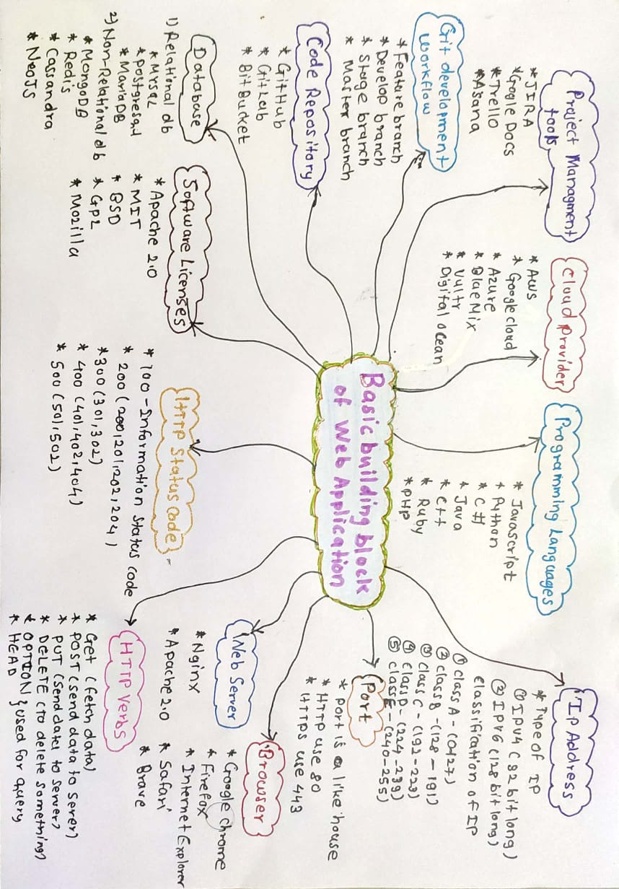

# Basic Building Blocks of Web Application Development

 

## Programming Languages
* Javascript
* Python
* C#
* Java
* C++
* Ruby
* Dart
* PHP
* Kotlin
------
## IP Address
* IP stand for internet protocol. 
* IP address is unique address that identify device on the internet or local network.
* It allow computer to send and receive information

## Types of IP
### 1. IPV4
* It is most commonly used IP address. 
* It is 32 bit long
### 2. IPV6
* It is 128 bit long

## Classification of IP
1. Class A –(0-127)
(0.0.0.0 -127-255.255.255)-  127  is reserved for local system .Any IP start with 127 is assigned to some kind of local sytem
2. Class B – (128-191) (internet)
3. Class C – (192-223) (reserve for local network eg.192.168 )
4. Class D – (224-239) (Not used/Reserved)
5. Class E – (240-255) (Not used)

------
## Port
* Port is like house
* 0-1023 (reserve port used by system)
* 1024-49150 (Application Port) - Ideally in node we use between only (3000-9999)
* 49151-65535 (Open port)
* The web ports are 80 and 443 where 80 is used for HTTP and 443 is used for HTTPS
* All the production app runs on the 443
------
## Browsers
* Google Chrome
* Firefox
* Internet Explorer
* Safari
* Brave (It is more secure version of chrome. It built top on the chrome that block evrything)
------
## Web server
* Nginx
* Apache 2.0 (It is web server as well as license)
------
## HTTP Verbs
* GET ( fetch data)
* POST(Send data to server)
* PUT (Send data to server)
* DELETE (To delete something)
* OPTION (Used for query)
* HEAD (Used for query)

------
## HTTP Headers
* Any web request goes to a server and any web request come from server will have headers.
* Server and browser communicate with headers
------
## HTTP Status Code
* 100 –Informational status code
* 200-(200,201,202,204) 
    - All successful request and response use 200 series. 
    - Whenever server respond these code then browser consider request has been successful
* 300-(301,302) 
    - Anything which require migration from one location to another
* 400-(401,402,404) 
    - Used for user authentication and user check. 
    - These are user specific port. eg:404 represent page not found
* 500-(501,502) 
    - These kind of header sent by server which indicate problem at server side 
    - Eg: Application not working, application crash, DB down, Db crash or System crash
------
## Software License
* Any software development can not happen without s/w license
* These licenses give legal protection to company or developer or anyone who is using it
    * Apache 2.0
    * MIT(Massachusetts Institute of Technology) –Node js use this license
    * BSD (Berkeley Software Distribution)
    * GPL (Used by linux)
    * Mozilla
------
## Database
* It is collection of inter related data
    * Relational database
        * MySql
        * PostgreSQL
        * MariaDB
    * Non-relational database
        * MongoDB
        * Redis
        * Cassandra
        * NeoJS
------
## Cloud Providers
* AWS
* Google Cloud
* Azure
* BlueMix
* Digital Ocean
* Vultr 
------

## Code Repository
* GitHub
* GitLab
* BitBucket
------
## Project Management tool
* JIRA-  It has Taks, stories
* Google Sheet
* Doc
* Trello
* Asana
------
## Git Development workflow
* Feature branch
* Develop branch
* Stage branch
* Master branch (deployed to production)
------

